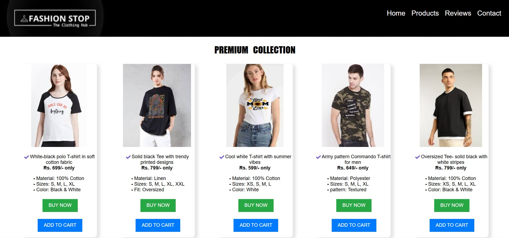
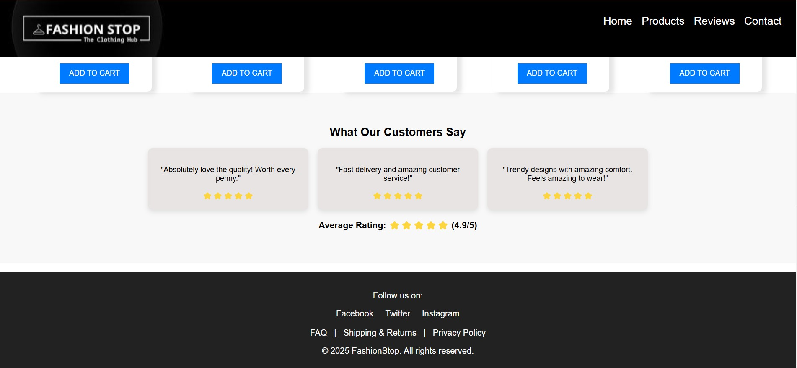

# E-commerce Home Page

A visually appealing and user-friendly Home page for an e-commerce website with an eye-catching heo section and stylish backgroubd.

## 📌Features

✅ Interactive **Navigation bar and footer** featuring major details

✅ Eye-catching **hero section*** with a stylish background

✅ Interactive **CTA's** like "Buy Now" and "Add To Cart" used.

✅ **Product gallery** with major highlights and reviews of products

✅ **Smooth transitions** (like: zooming of image) for an interactive experience
## Tech-Stacks Used

1. HTML
2. CSS
3. JS

## Brief Description
The project features the **home page of an e-commerce clothing website**. The hero section is the most eye-catching feature of the web-page. It has a stylish background utilising **linear gradient, rgba and opacity effects**. The product gallery features the premium colllection of the brand. **Zoom in feature** has also been added in the images with the help of transitions. **Interactive CTA's like "Buy Now" and "Add To Cart"** have been added at appropriate places. A user-friendly **navigation bar**, a **structured footer** with support links, social media handles, etc. has also been added to increase customer engagement.

## 📷 Preview

## Installation & Setup
1. Clone the repository.
2. Open the project in any code editor (e.g., VS Code) and run it using a live server.
3. If using Live Server extension in VS Code, right-click on index.html and select "Open with Live Server".

## Usage

1. Navigate through the homepage and interact with different elements.
2. Try clicking on the various CTA's to see the results.
3. Hover over the images to see the zoom effect